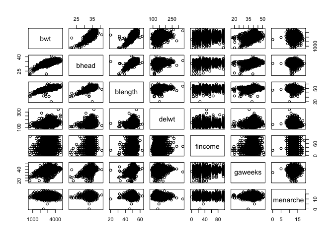
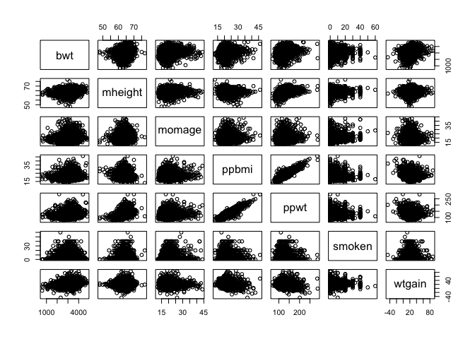
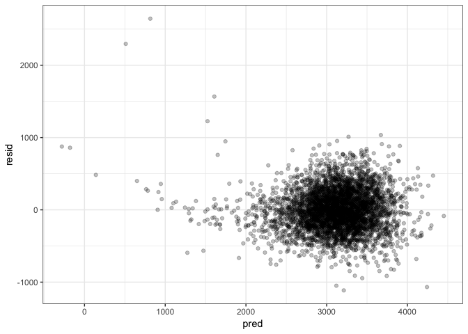

p8105\_hw6\_hx2263
================
Tiffany Xi
11/19/2018

Problem 1
=========

### Import data

``` r
raw_homicide = read_csv("https://raw.githubusercontent.com/washingtonpost/data-homicides/master/homicide-data.csv")
```

### Data tidy

``` r
homicide_tidy = 
  raw_homicide %>% 
  janitor::clean_names() %>%
  mutate(city_state = str_c(city, ", ", state)) %>% 
  mutate(status = as.numeric(disposition == "Closed by arrest")) %>% 
  filter(!(city_state %in% c("Dallas, TX", "Phoenix, AZ", "Kansas City, MO", "Tulsa, AL"))) %>%
  mutate(victim_race = ifelse(victim_race == "White", "white", "non-white"),
         victim_race = fct_relevel(victim_race, ref = "white"),
         victim_age = as.numeric(victim_age))
```

After data cleaning, the tidy dataset consists 48507 rows by 14 columns.

### glm in Baltimore, MD

Logistic regression with resolved vs unresolved as the outcome and victim age, sex and race as predictors

``` r
baltimore_log = 
  homicide_tidy %>% 
  filter(city_state == "Baltimore, MD") %>% 
  glm(status ~ victim_age + victim_sex + victim_race, data = ., family = binomial())

baltimore_log %>% broom::tidy()
```

    ## # A tibble: 4 x 5
    ##   term                 estimate std.error statistic  p.value
    ##   <chr>                   <dbl>     <dbl>     <dbl>    <dbl>
    ## 1 (Intercept)           1.19      0.235        5.06 4.30e- 7
    ## 2 victim_age           -0.00699   0.00326     -2.14 3.22e- 2
    ## 3 victim_sexMale       -0.888     0.136       -6.53 6.80e-11
    ## 4 victim_racenon-white -0.820     0.175       -4.69 2.68e- 6

the estimate and CI of the **adjusted odds ratio** for solving homicides comparing non-white victims to white victims keeping all other variables fixed

``` r
baltimore_OR_CI = 
  baltimore_log %>% 
  broom::tidy(conf.int = TRUE) %>% 
  mutate(OR = exp(estimate),
         conf_lower = exp(conf.low),
         conf_upper = exp(conf.high)) %>% 
  select(term, OR, conf_lower, conf_upper) %>% 
  filter(term == "victim_racenon-white") %>%
  knitr::kable(digits = 3)

baltimore_OR_CI
```

| term                  |     OR|  conf\_lower|  conf\_upper|
|:----------------------|------:|------------:|------------:|
| victim\_racenon-white |  0.441|        0.312|         0.62|

*Comment*: According to the result of linear regression model, the adjusted odds ratio of solved homicides in Baltimore, MD which the victim race is non-white is 0.441 times the adjusted odds ratio of solved homicides when the victim race is white. 95% CI is between 0.312 and 0.62.

### glm for each cities

``` r
eachcity_log = 
  homicide_tidy %>% 
  group_by(city_state) %>% 
  nest() %>% 
  mutate(models = map(data, ~glm(status ~ victim_age + victim_sex + victim_race,
                                   data = ., family = binomial())),
         model_ci = map(models, broom::confint_tidy),
         models = map(models, broom::tidy)) %>% 
  select(-data) %>% 
  unnest() %>% 
  filter(term == "victim_racenon-white") %>% 
  mutate(OR = round(exp(estimate), 3),
         conf_lower = round(exp(conf.low), 3),
         conf_upper = round(exp(conf.high), 3)) %>% 
  select(city_state, OR, conf_lower, conf_upper)

head(eachcity_log)
```

    ## # A tibble: 6 x 4
    ##   city_state         OR conf_lower conf_upper
    ##   <chr>           <dbl>      <dbl>      <dbl>
    ## 1 Albuquerque, NM 0.741      0.449      1.22 
    ## 2 Atlanta, GA     0.753      0.424      1.30 
    ## 3 Baltimore, MD   0.441      0.312      0.62 
    ## 4 Baton Rouge, LA 0.668      0.304      1.40 
    ## 5 Birmingham, AL  1.04       0.612      1.75 
    ## 6 Boston, MA      0.115      0.043      0.259

### Visualization

``` r
eachcity_log %>%
  ggplot(aes(x = reorder(city_state, OR), y = OR)) +
  coord_flip() + 
  geom_point(size = 1.5, shape = 18, fill = "white") +
  geom_errorbar(mapping = aes(ymin = conf_lower, ymax = conf_upper)) +
  geom_hline(yintercept = 1, alpha = 0.4, color = "red") +
  labs(
        title = "Estimates OR and CIs for Each City",
        x = "City State",
        y = "Estimate Odd Ratio and CI",
        caption = "Data from the github package"
      ) +
    theme(axis.text = element_text(size = 8))
```


*Comment* According to the plot above, we can see that the adjusted OR in most cities (44 out of 47) of solving homicides comparing non-white to white victims is less than 1, which means in most cities, homicides with non-white victim are less likely to be solved than those with white victims. Also, cities with higher OR estimate tend to have wider confidence interval. This indicates the estimate in cities like `Tampa, FL`, `Durham, NC` are less precise than `Boston, MA`, `Omaha, NE`.

Problem 2
=========

### Load and clean the data

``` r
raw_birthweight = read_csv(file = "./data/birthweight.csv")

birthweight_tidy = 
  raw_birthweight %>% 
  janitor::clean_names() %>% 
  mutate(babysex = as.factor(babysex),
         frace = as.factor(frace),
         frace = recode_factor(frace, `1` = 'White', `2` = 'Black', 
                               `3` = 'Asian', `4` = 'Puerto Rican', 
                               `8` = 'Other', `9` = 'Unknown'),
         malform = as.factor(malform),
         mrace = as.factor(mrace),
         mrace = recode_factor(mrace, `1` = 'White', `2` = 'Black',
                               `3` = 'Asian', `4` = 'Puerto Rican',
                               `8` = 'Other')) %>% 
  select(bwt, everything()) 

# check for missing data
map(birthweight_tidy, ~sum(is.na(.)))
```

    ## $bwt
    ## [1] 0
    ## 
    ## $babysex
    ## [1] 0
    ## 
    ## $bhead
    ## [1] 0
    ## 
    ## $blength
    ## [1] 0
    ## 
    ## $delwt
    ## [1] 0
    ## 
    ## $fincome
    ## [1] 0
    ## 
    ## $frace
    ## [1] 0
    ## 
    ## $gaweeks
    ## [1] 0
    ## 
    ## $malform
    ## [1] 0
    ## 
    ## $menarche
    ## [1] 0
    ## 
    ## $mheight
    ## [1] 0
    ## 
    ## $momage
    ## [1] 0
    ## 
    ## $mrace
    ## [1] 0
    ## 
    ## $parity
    ## [1] 0
    ## 
    ## $pnumlbw
    ## [1] 0
    ## 
    ## $pnumsga
    ## [1] 0
    ## 
    ## $ppbmi
    ## [1] 0
    ## 
    ## $ppwt
    ## [1] 0
    ## 
    ## $smoken
    ## [1] 0
    ## 
    ## $wtgain
    ## [1] 0

``` r
skimr::skim(birthweight_tidy)
```

    ## Skim summary statistics
    ##  n obs: 4342 
    ##  n variables: 20 
    ## 
    ## ── Variable type:factor ───────────────────────────────────────────────────────────────────────────
    ##  variable missing complete    n n_unique
    ##   babysex       0     4342 4342        2
    ##     frace       0     4342 4342        5
    ##   malform       0     4342 4342        2
    ##     mrace       0     4342 4342        4
    ##                               top_counts ordered
    ##                  1: 2230, 2: 2112, NA: 0   FALSE
    ##  Whi: 2123, Bla: 1911, Pue: 248, Asi: 46   FALSE
    ##                    0: 4327, 1: 15, NA: 0   FALSE
    ##  Whi: 2147, Bla: 1909, Pue: 243, Asi: 43   FALSE
    ## 
    ## ── Variable type:integer ──────────────────────────────────────────────────────────────────────────
    ##  variable missing complete    n      mean     sd  p0  p25    p50  p75 p100
    ##     bhead       0     4342 4342   33.65     1.62  21   33   34     35   41
    ##   blength       0     4342 4342   49.75     2.72  20   48   50     51   63
    ##       bwt       0     4342 4342 3114.4    512.15 595 2807 3132.5 3459 4791
    ##     delwt       0     4342 4342  145.57    22.21  86  131  143    157  334
    ##   fincome       0     4342 4342   44.11    25.98   0   25   35     65   96
    ##  menarche       0     4342 4342   12.51     1.48   0   12   12     13   19
    ##   mheight       0     4342 4342   63.49     2.66  48   62   63     65   77
    ##    momage       0     4342 4342   20.3      3.88  12   18   20     22   44
    ##    parity       0     4342 4342    0.0023   0.1    0    0    0      0    6
    ##   pnumlbw       0     4342 4342    0        0      0    0    0      0    0
    ##   pnumsga       0     4342 4342    0        0      0    0    0      0    0
    ##      ppwt       0     4342 4342  123.49    20.16  70  110  120    134  287
    ##    wtgain       0     4342 4342   22.08    10.94 -46   15   22     28   89
    ##      hist
    ##  ▁▁▁▁▅▇▁▁
    ##  ▁▁▁▁▁▇▁▁
    ##  ▁▁▁▃▇▇▂▁
    ##  ▁▇▅▁▁▁▁▁
    ##  ▁▂▇▂▂▂▁▃
    ##  ▁▁▁▁▂▇▁▁
    ##  ▁▁▁▅▇▂▁▁
    ##  ▂▇▅▂▁▁▁▁
    ##  ▇▁▁▁▁▁▁▁
    ##  ▁▁▁▇▁▁▁▁
    ##  ▁▁▁▇▁▁▁▁
    ##  ▁▇▆▁▁▁▁▁
    ##  ▁▁▁▇▇▁▁▁
    ## 
    ## ── Variable type:numeric ──────────────────────────────────────────────────────────────────────────
    ##  variable missing complete    n  mean   sd    p0   p25   p50   p75 p100
    ##   gaweeks       0     4342 4342 39.43 3.15 17.7  38.3  39.9  41.1  51.3
    ##     ppbmi       0     4342 4342 21.57 3.18 13.07 19.53 21.03 22.91 46.1
    ##    smoken       0     4342 4342  4.15 7.41  0     0     0     5    60  
    ##      hist
    ##  ▁▁▁▁▃▇▁▁
    ##  ▁▇▅▁▁▁▁▁
    ##  ▇▁▁▁▁▁▁▁

``` r
birthweight_tidy %>% 
  select(-babysex, -frace, -mrace, -malform, -pnumlbw, -pnumsga, -parity) %>% 
  select(bwt, bhead, blength, delwt, fincome, gaweeks, menarche) %>% 
  plot()
```



``` r
birthweight_tidy %>% 
  select(bwt, mheight, momage, ppbmi, ppwt, smoken, wtgain) %>% 
  plot()
```



Propose a regression model for birthweight.

I

``` r
model_my = lm(bwt ~ bhead + blength + ppbmi + wtgain, data = birthweight_tidy)
summary(model_my)
```

    ## 
    ## Call:
    ## lm(formula = bwt ~ bhead + blength + ppbmi + wtgain, data = birthweight_tidy)
    ## 
    ## Residuals:
    ##      Min       1Q   Median       3Q      Max 
    ## -1114.04  -189.11    -8.43   176.30  2644.19 
    ## 
    ## Coefficients:
    ##               Estimate Std. Error t value Pr(>|t|)    
    ## (Intercept) -6002.6416    97.4179 -61.617  < 2e-16 ***
    ## bhead         142.6052     3.4698  41.099  < 2e-16 ***
    ## blength        82.8625     2.0653  40.120  < 2e-16 ***
    ## ppbmi           5.0665     1.3819   3.666 0.000249 ***
    ## wtgain          3.9181     0.4091   9.578  < 2e-16 ***
    ## ---
    ## Signif. codes:  0 '***' 0.001 '**' 0.01 '*' 0.05 '.' 0.1 ' ' 1
    ## 
    ## Residual standard error: 286 on 4337 degrees of freedom
    ## Multiple R-squared:  0.6884, Adjusted R-squared:  0.6881 
    ## F-statistic:  2395 on 4 and 4337 DF,  p-value: < 2.2e-16

### plot of model residuals against fitted values

``` r
birthweight_tidy %>% 
  add_predictions(model_my) %>% 
  add_residuals(model_my) %>% 
  ggplot(aes(x = pred, y = resid)) +
  geom_point(alpha = 0.25)
```



Compare your model to two others:

One using length at birth and gestational age as predictors (main effects only)

``` r
model_1 = lm(bwt ~ blength + gaweeks, data = birthweight_tidy)
summary(model_1)
```

    ## 
    ## Call:
    ## lm(formula = bwt ~ blength + gaweeks, data = birthweight_tidy)
    ## 
    ## Residuals:
    ##     Min      1Q  Median      3Q     Max 
    ## -1709.6  -215.4   -11.4   208.2  4188.8 
    ## 
    ## Coefficients:
    ##              Estimate Std. Error t value Pr(>|t|)    
    ## (Intercept) -4347.667     97.958  -44.38   <2e-16 ***
    ## blength       128.556      1.990   64.60   <2e-16 ***
    ## gaweeks        27.047      1.718   15.74   <2e-16 ***
    ## ---
    ## Signif. codes:  0 '***' 0.001 '**' 0.01 '*' 0.05 '.' 0.1 ' ' 1
    ## 
    ## Residual standard error: 333.2 on 4339 degrees of freedom
    ## Multiple R-squared:  0.5769, Adjusted R-squared:  0.5767 
    ## F-statistic:  2958 on 2 and 4339 DF,  p-value: < 2.2e-16

One using head circumference, length, sex, and all interactions (including the three-way interaction) between these

``` r
model_2 = lm(bwt ~ bhead + blength + babysex + bhead*blength + blength*babysex +  bhead*babysex + bhead*blength*babysex, data = birthweight_tidy)
summary(model_2)
```

    ## 
    ## Call:
    ## lm(formula = bwt ~ bhead + blength + babysex + bhead * blength + 
    ##     blength * babysex + bhead * babysex + bhead * blength * babysex, 
    ##     data = birthweight_tidy)
    ## 
    ## Residuals:
    ##      Min       1Q   Median       3Q      Max 
    ## -1132.99  -190.42   -10.33   178.63  2617.96 
    ## 
    ## Coefficients:
    ##                          Estimate Std. Error t value Pr(>|t|)    
    ## (Intercept)            -7176.8170  1264.8397  -5.674 1.49e-08 ***
    ## bhead                    181.7956    38.0542   4.777 1.84e-06 ***
    ## blength                  102.1269    26.2118   3.896 9.92e-05 ***
    ## babysex2                6374.8684  1677.7669   3.800 0.000147 ***
    ## bhead:blength             -0.5536     0.7802  -0.710 0.478012    
    ## blength:babysex2        -123.7729    35.1185  -3.524 0.000429 ***
    ## bhead:babysex2          -198.3932    51.0917  -3.883 0.000105 ***
    ## bhead:blength:babysex2     3.8781     1.0566   3.670 0.000245 ***
    ## ---
    ## Signif. codes:  0 '***' 0.001 '**' 0.01 '*' 0.05 '.' 0.1 ' ' 1
    ## 
    ## Residual standard error: 287.7 on 4334 degrees of freedom
    ## Multiple R-squared:  0.6849, Adjusted R-squared:  0.6844 
    ## F-statistic:  1346 on 7 and 4334 DF,  p-value: < 2.2e-16

cv\_df = cv\_df %&gt;% mutate(model\_my = map(train, ~lm(y ~ x, data = .x)), model\_1 = map(train, ~mgcv::gam(y ~ s(x), data = .x)), model\_2 = map(train, ~gam(y ~ s(x, k = 30), sp = 10e-6, data = .x))) %&gt;% mutate(rmse\_lin = map2\_dbl(lin\_mod, test, ~rmse(model = .x, data = .y)), rmse\_nonlin = map2\_dbl(nonlin\_mod, test, ~rmse(model = .x, data = .y)), rmse\_wiggly = map2\_dbl(wiggly\_mod, test, ~rmse(model = .x, data = .y))) %&gt;% select(starts\_with("rmse")) %&gt;% gather(key = model, value = rmse) %&gt;% mutate(model = str\_replace(model, "rmse\_", ""), model = fct\_inorder(model)) %&gt;% ggplot(aes(x = model, y = rmse)) + geom\_violin()
