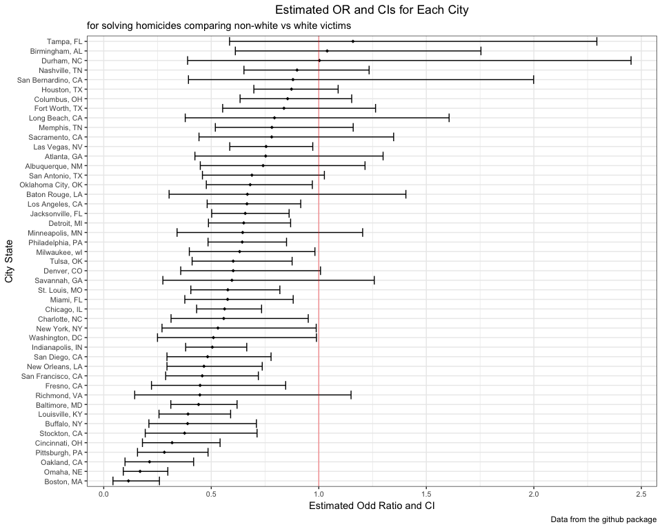

p8105\_hw6\_hx2263
================
Tiffany Xi
11/19/2018

Problem 1
=========

### Import data

``` r
raw_homicide = read.csv("https://raw.githubusercontent.com/washingtonpost/data-homicides/master/homicide-data.csv")
```

### Data tidy

Create a `city_state` variable and a binary variable indicating whether the homicide is solved; omit cities as required; modifiy `victim_race` to have categories white and non-white, with white as the reference category; victim\_age is numeric.

``` r
homicide_tidy = 
  raw_homicide %>% 
  mutate(city_state = str_c(city, ", ", state)) %>% 
  mutate(status = as.numeric(disposition == "Closed by arrest")) %>% 
  filter(!(city_state %in% c("Dallas, TX", "Phoenix, AZ", "Kansas City, MO", "Tulsa, AL"))) %>%
  mutate(victim_race = ifelse(victim_race == "White", "white", "non-white"),
         victim_race = fct_relevel(victim_race, ref = "white"),
         victim_age = as.numeric(victim_age))
```

### glm in Baltimore, MD

Use `glm` to fit a logistic regression with resolved vs unresolved as the outcome and victim age, sex and race as predictors

``` r
baltimore_log = 
  homicide_tidy %>% 
  filter(city_state == "Baltimore, MD") %>% 
  glm(status ~ victim_age + victim_sex + victim_race, data = ., family = binomial())

baltimore_log %>% broom::tidy()
```

    ## # A tibble: 4 x 5
    ##   term                 estimate std.error statistic  p.value
    ##   <chr>                   <dbl>     <dbl>     <dbl>    <dbl>
    ## 1 (Intercept)           1.05      0.227        4.62 3.78e- 6
    ## 2 victim_age           -0.00374   0.00303     -1.23 2.17e- 1
    ## 3 victim_sexMale       -0.885     0.136       -6.50 8.08e-11
    ## 4 victim_racenon-white -0.793     0.174       -4.55 5.33e- 6

Obtain the estimate and confidence interval of the adjusted odds ratio for solving homicides comparing black victims to white victims keeping all other variables fixed.

``` r
baltimore_OR_CI = 
  baltimore_log %>% 
  broom::tidy() %>% 
  mutate(OR = exp(estimate),
         conf_lower = exp(estimate - 1.96 * std.error),
         conf_upper = exp(estimate + 1.96 * std.error)) %>% 
  select(term, OR, conf_lower, conf_upper)
```

### glm for each cities

Run glm for each cities, and extract the adjusted odds ratio (and CI) for solving homicides comparing black victims to white victims.

``` r
eachcity_log = 
  homicide_tidy %>% 
  group_by(city_state) %>% 
  nest() %>% 
  mutate(models = map(data, ~glm(status ~ victim_age + victim_sex + victim_race,
                                   data = ., family = binomial())),
         models = map(models, broom::tidy)) %>% 
  select(-data) %>% 
  unnest() %>% 
  filter(term == "victim_racenon-white") %>% 
  mutate(OR = round(exp(estimate), 3),
         conf_lower = round(exp(estimate - 1.96 * std.error), 3),
         conf_upper = round(exp(estimate + 1.96 * std.error), 3)) %>% 
  select(city_state, OR, conf_lower, conf_upper)
```

### Visualization

``` r
eachcity_log %>%
  ggplot(aes(x = reorder(city_state, OR), y = OR)) +
  coord_flip() + 
  geom_point(size = 1.5, shape = 18, fill = "white") +
  geom_errorbar(mapping = aes(ymin = conf_lower, ymax = conf_upper)) +
  geom_hline(yintercept = 1, alpha = 0.4, color = "red") +
  labs(
        title = "Estimates OR and CIs for Each City",
        x = "City State",
        y = "Estimate Odd Ratio and CI",
        caption = "Data from the github package"
      ) +
    theme_bw() +
    theme(axis.text = element_text(size = 8))
```


